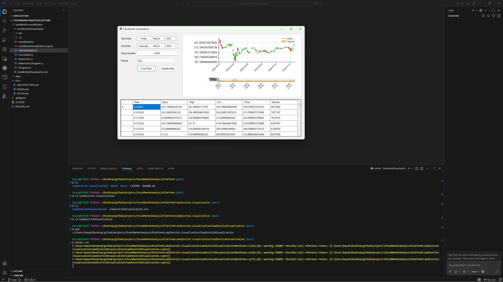
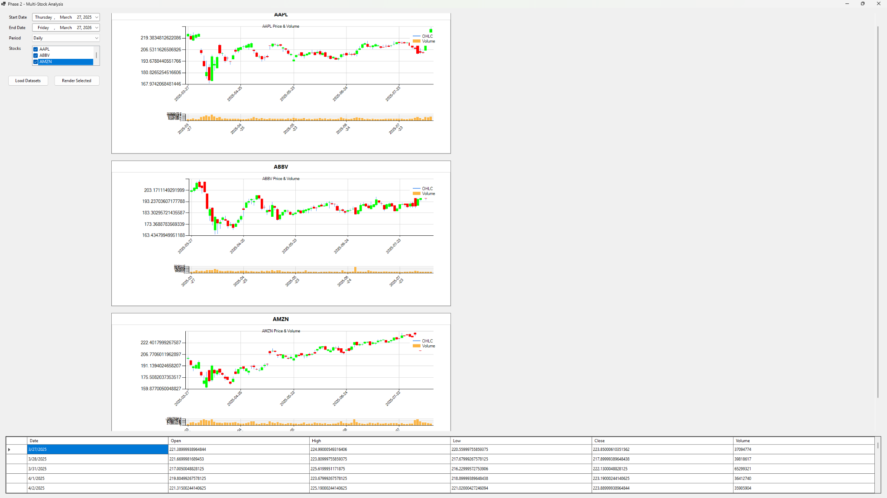

````md
# 📈 Stock Market Analysis Platform

A desktop stock market visualization and technical analysis application built using **C# and .NET Windows Forms**.

The application loads historical stock market data from CSV files and visualizes price movement using **candlestick charts, trading volume graphs, and technical indicator overlays**.

Users can filter datasets by date range, select multiple stocks, and apply technical indicators like **SMA and EMA** to analyze trends.

---

## 🚀 Project Overview

Financial markets generate large volumes of time-series data. This project provides a platform to:

- Import and parse historical stock data
- Visualize OHLC candlestick charts
- Display trading volume
- Filter by date range and time interval
- Compare multiple stocks side-by-side
- Apply technical indicators for analysis

---

## 📊 Features

### ✅ Phase 1 — Data Loading & Visualization
- CSV data ingestion (Yahoo Finance format)
- Candlestick chart visualization
- Volume chart display
- Date range filtering
- Time aggregation (Daily, Weekly, Monthly)
- CSV validation

---

### ✅ Phase 2 — Multi-Stock Comparison
- Multi-stock selection (checkbox list)
- Dynamic chart panels
- Side-by-side stock comparison
- Shared filtering across all stocks
- FlowLayoutPanel-based UI layout

---

### ✅ Phase 3 — Technical Analysis
- Simple Moving Average (SMA)
- Exponential Moving Average (EMA)
- Adjustable indicator periods
- Indicator toggle controls
- Overlay indicators on candlestick charts

---

## 🖥️ Visual Output

### 📊 Phase 1 — Single Stock Visualization


---

### 📈 Phase 2 — Multi-Stock Comparison


---

### 📉 Phase 3 — Technical Analysis with Indicators


---

## 🧠 Architecture Overview

### Models
- Candlestick
- StockDataset
- IndicatorPoint

### Services
- CsvLoader
- DataAggregator
- StockRepository

### Indicators
- MovingAverageCalculator (SMA)
- ExponentialMovingAverageCalculator (EMA)

### Rendering
- ChartRenderer

### UI
- MainForm
- StockChartPanelFactory

---

## ⚙️ Technologies Used

- **Language:** C#
- **Framework:** .NET 8 Windows Forms
- **Charts:** WinForms DataVisualization
- **UI Components:** DataGridView, FlowLayoutPanel

---

## 📁 Project Structure

```text
stock-market-analysis-platform
│
├── data
├── docs
│   ├── PHASE_1.md
│   ├── PHASE_2.md
│   ├── PHASE_3.md
│   ├── DEMO.md
│   ├── ARCHITECTURE.md
│   └── SETUP.md
│
├── images
│   ├── phase1-chart.jpg
│   ├── phase2-multistock.jpg
│   └── Phase3-TechnicalAnalysis.jpg
│
├── src
│   └── candlestick-visualization
│       ├── Phase1_CandlestickVisualization
│       ├── Phase2_MultiStockAnalysis
│       └── Phase3_TechnicalAnalysis
│
├── README.md
├── LICENSE
└── .gitignore
````

---

## 🧪 Running the Project

```bash
cd src/candlestick-visualization/Phase3_TechnicalAnalysis
dotnet run
```

---

## 🔮 Future Improvements

* RSI Indicator
* MACD
* Bollinger Bands
* Trading signals (crossovers)
* Real-time API integration

---

## 📄 License

MIT License

```
```
